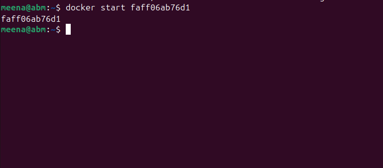
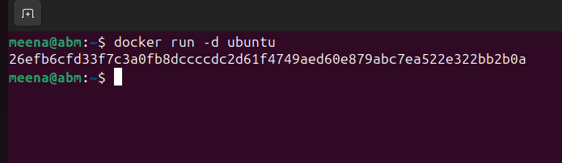
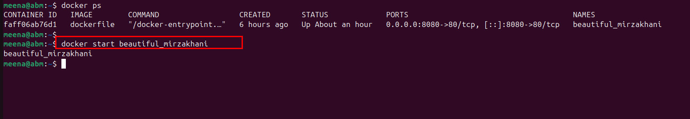
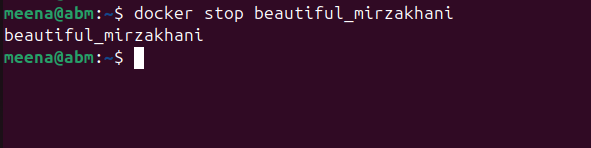
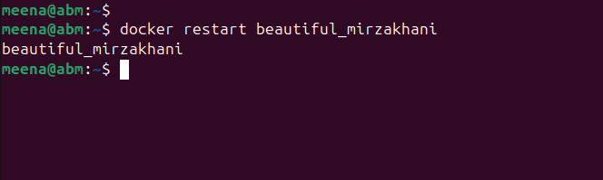
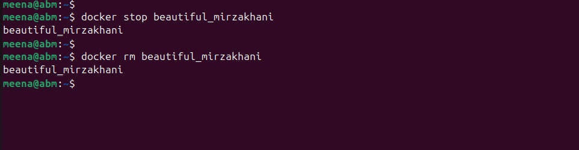

# Working_With_Docker_Container 

# Introduction To Docker Container.
A Docker container is a lightweight, portable, and self-sufficient environment that allows you to run an application along with all its dependencies consistently across different systems. It’s part of the Docker platform, which is widely used for containerization. Let me break it down clearly:

Key Concepts:
1. Container vs Virtual Machine (VM):

VMs: Run a full operating system with a hypervisor. Heavyweight and slower to start.

Containers: Share the host OS kernel, but isolate applications. Lightweight and start almost instantly.

2. What’s Inside a Docker Container:

Your application code.

Libraries and dependencies needed to run the app.

Configuration files.

Minimal OS-level components (Docker doesn’t include a full OS, just the essentials).

3. Isolation:

Containers are isolated from each other and the host system.

Each container thinks it has its own environment but shares the host OS kernel.

4. Portability:

Docker containers can run anywhere: on your local machine, a server, or in the cloud.

“It works on my machine” becomes a reality because the container includes everything the app needs.

5. Images vs Containers:

Docker Image: A read-only blueprint (like a class) used to create containers.

Docker Container: A running instance of an image (like an object of that class).

# Running Containers
To run a container, you use the docker run command followed by the name of the image you want to use.

Recall that we pulled an ubuntu image from the official ubuntu repository on docker hub. Let's create a container from the ubuntu image. This command launches a container based on the Ubuntu image.

"docker run ubuntu"
.

the above shows that the container was created but not running. we can start the container by running 
" docker start container_ID"
.

# Launching Containers with Different Options
Docker provides various options to customize the behavior of containers. For example, you can specify environment variables, map ports, and mount volumes. Here's an example of running a container with a specific environment variable:
"docker run -e "MY_VARIABLE=my-value" ubuntu"

# Running Containers in the Background
By default, containers run in the foreground, and the terminal is attached to the container's standard input/output. To run a container in the background, use the -d option: 

" docker run -d ubuntu "
.

# Container Lifecycle
Containers have a lifecycle that includes creating, starting, stopping, and restarting. Once a container is created, it can be started and stopped multiple times. 
1. To start : run "docker start container_name"

.

2. To stop running container : run "docker stop container_name"
.

3. To restart a container : run " docker restart conatainer_name"

.

# REmoving Containers 
To remove a container you use the 'docker rm' command followed by the container ID's or name

"docker rm container_name"
But note that docker wont let you remove a container while it is runnung untill you stopped it .

.

This deletes the container, but keep in mind that the associated image remains on your system.

In this module, you've learned the basics of working with Docker containers—launching them, customizing their behavior, managing their lifecycle, and removing them. Understanding these fundamentals is crucial for effectively using Docker in your development and deployment workflows.

